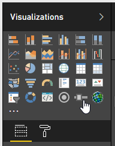
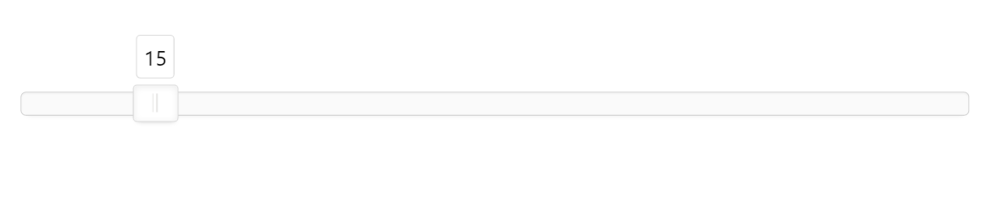
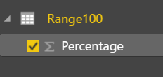
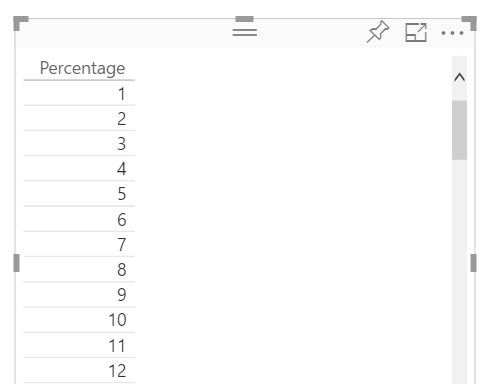
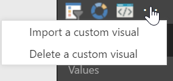
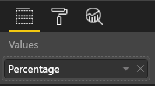
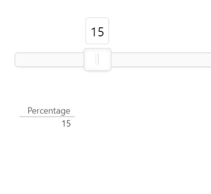
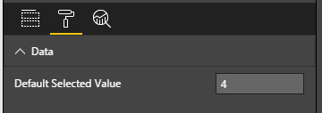
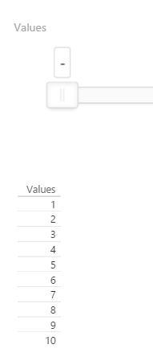

# Power BI Range Slider Custom Visual

Range Slider is a Power BI custom visual that allows you to filter a report based on a slider value. It uses the open source [noUiSlider](https://github.com/leongersen/noUiSlider/), which is licensed via [WTFPL](http://www.wtfpl.net/about/).

Here's how to use it:

## Data
1\. **Lookup Table** The range values need to come from a lookup table in your dataset. For example, if you want to have a slider that goes from 1, 2, 3, 4...100, then you need to have a column in your dataset that contains each those values.  You'll assign that column to the Range Slider's "Values" data property. The values will be automatically sorted in ascending order by the range slider.

Here's an example of a lookup table that is a valid datasource for the Range Slider. We have a table called Range100, with a column called Percentage that contains values 1, 2, 3, 4...100.

 

2\. **Values Data Type** The range values need to be numbers. The slider visual supports whole numbers or decimal numbers and will truncate any trailing zeros. For example, 98.60 will be displayed as 98.6 and 9.0 will be displayed as 9. 

3\. **Values Size Limit** You are limited to 30,000 values in the slider. This is a Power BI limitation. I'm working on finding a way around this.

## Usage
1\. Download the Range Slider custom visual by clicking [here](https://github.com/jonbgallant/PowerBI-visuals-rangeSlider/raw/master/rangeSlider/dist/rangeSlider.pbiviz).

2\. Import the Range Slider custom visual into your report.

3\. Click on the Range Slider icon to add it to your report.

4\. Assign a lookup table column to the "Values" data property.

5\. Move the slider and observe the rest of your report being filtered by the selected value.

In this example, we have a table and a slider both bound to Range100/Percentage. When the slider is set to 15, then the table will be filtered to 15 as well.

### Default Selected Value

You can also set a default selected value in the format properties pane. This value will automatically be selected when the report loads for your users.

## Clear Filter

If you slide the filter all the way to the left, it will clear the filter.

## Issues or Feedback

Please submit any issues, feedback or feature requests here: [http://github.com/jonbgallant/PowerBI-visuals-rangeSlider/issues](http://github.com/jonbgallant/PowerBI-visuals-rangeSlider/issues)